# NowSquare Nearby Platform
Multi-user Mobile CMS with deals, coupons, rewards, business cards, QR codes and more. Licensed under the permissive MIT License.


## Requirements
The script requires the MySQL version and PHP version and extensions as described below.

 - MySQL >= 5.7.8
 - PHP 7.2.x or higher
   - OpenSSL PHP Extension
   - PDO PHP Extension
   - Mbstring PHP Extension
   - Tokenizer PHP Extension
   - XML PHP Extension
   - Ctype PHP Extension
   - JSON PHP Extension
   - GD PHP Extension
   - ZipArchive PHP Extension
  
## Installation
> The script has to be installed on the root of a domain or subdomain. It does not work in a subdirectory.

### Upload or clone
You can download this repository as a Zip, extract all files and upload them to your web root, or clone the repository with Git.

Log in to your VPS or web server, and go to the web root directory. For example:

``` bash
$ cd /srv/path/to/app/public
```

Clone the Git repository:

> Make sure you include the dot (.) at the end. It will tell the Git command to clone to the current directory.

``` bash
$ git clone https://github.com/NowSquare/Nearby-Platform.git .
```

All files will be downloaded to the `public` folder now.

### Settings
When all files are uploaded, open the url where the script is installed. The install page will open where you can enter the required settings.

If you want to re-install the script, remove the `.env` file in the root, and drop all tables of the database.

## Manual installation
If you don't want to run the automatic installation, you can copy and edit the config file directly.

In the root directory, there is an example config file `.env.example`. Copy this file to `.env` and open it to edit:
``` bash
$ cp .env.example .env
$ sudo nano .env
```

In the config file you can enter the database credentials set up earlier. Set up a domain in your [mailgun.com](https://www.mailgun.com/) account and enter the details at the mail settings. Also, make sure you enter the correct `APP_URL`.

Get your [Google Maps key](https://developers.google.com/maps/documentation/javascript/get-api-key), and enter it at the `GMAPS_KEY` parameter. It should look something like this:

``` 
GMAPS_KEY="AIzuSyTkg4y-D0LT5gvUWFCgmCoSiMJq-Tf1JwM"
``` 

## Generate and seed database
Once the config file database settings are configured, you can create the tables and default records with the following commands:

``` bash
$ php artisan migrate
$ php artisan db:seed
```

The database will be generated and you can login with `info@example.com` and the password `welcome`.

## Queues

> This is not mandatory, but is recommended for a better perfomance. For example, the PDF of a deal is generated in the background to avoid waiting time.

When a mail is sent, or a PDF is generated by the system, this is done with a queue so there is no delay for the user and slow tasks aren't interrupted when a user visits another page.

If you choose to use supervisor, set `QUEUE_CONNECTION=database` in the `.env` config file.

### Installing Supervisor
Supervisor is a process monitor for the Linux operating system, and will automatically restart your `queue:work` process if it fails. To install Supervisor on Ubuntu, you may use the following command:
``` bash
$ sudo apt-get install supervisor
```

### Configuring Supervisor

Supervisor configuration files are typically stored in the `/etc/supervisor/conf.d` directory. Within this directory, you may create any number of configuration files that instruct supervisor how your processes should be monitored. For example, let's create a `name_of_your_app.conf` file that starts and monitors a `queue:work` process:

```
[program:name_of_your_app]
process_name=%(program_name)s_%(process_num)02d
command=php /srv/users/serverpilot/apps/name_of_your_app/public/artisan queue:work database --sleep=3 --tries=3
autostart=true
autorestart=true
user=serverpilot
numprocs=8
redirect_stderr=true
stdout_logfile=/srv/users/serverpilot/apps/name_of_your_app/supervisor.log
``` 

In this example, the `numprocs` directive will instruct Supervisor to run 8 `queue:work` processes and monitor all of them, automatically restarting them if they fail. Of course, you should change the `queue:work sqs` portion of the `command` directive to reflect your desired queue connection.

### Starting Supervisor
Once the configuration file has been created, you may update the Supervisor configuration and start the processes using the following commands:

``` bash
$ sudo supervisorctl reread
$ sudo supervisorctl update
$ sudo supervisorctl start name_of_your_app:*
```

For more information on Supervisor, consult the [Supervisor documentation](http://supervisord.org/index.html).

### Troubleshooting
If queues are not triggered, restart the service with this command:

``` bash
$ service supervisor restart
```

## First login

When the script is installed, you can login with the following credentials:

**E-mail:** info@example.com

**Password:** welcome

## Screens


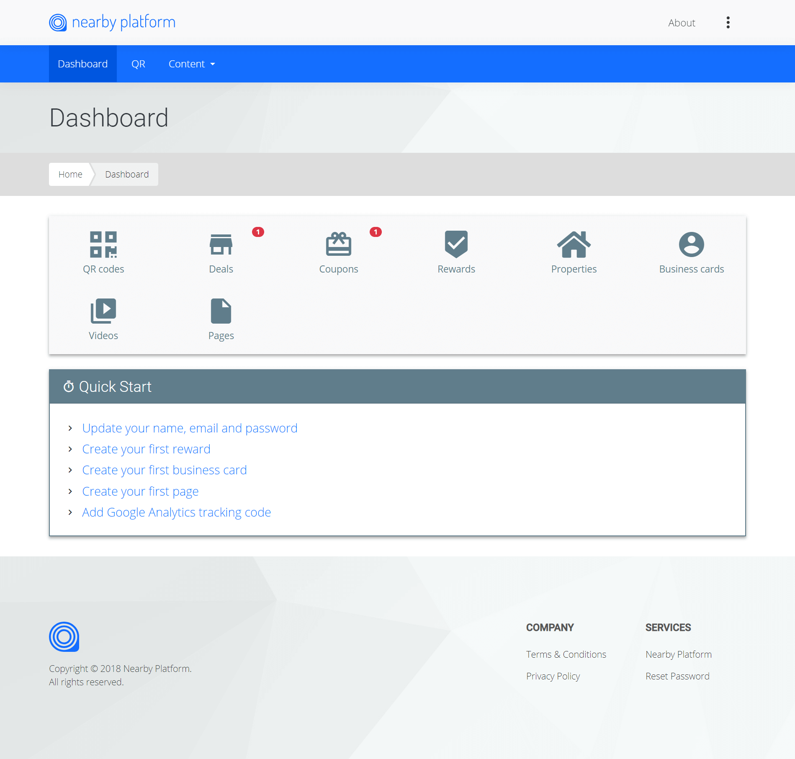

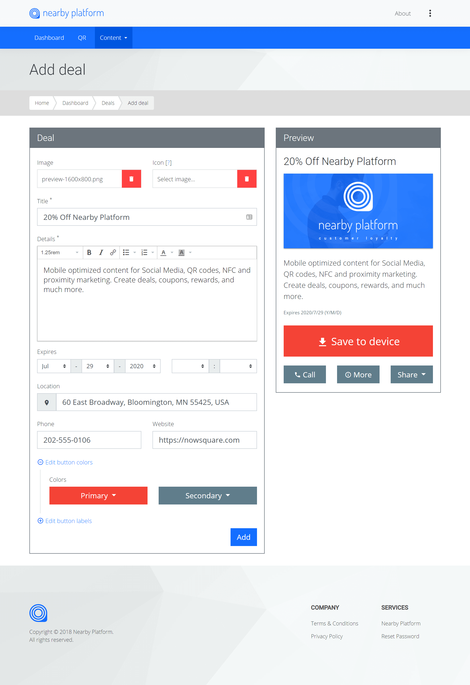

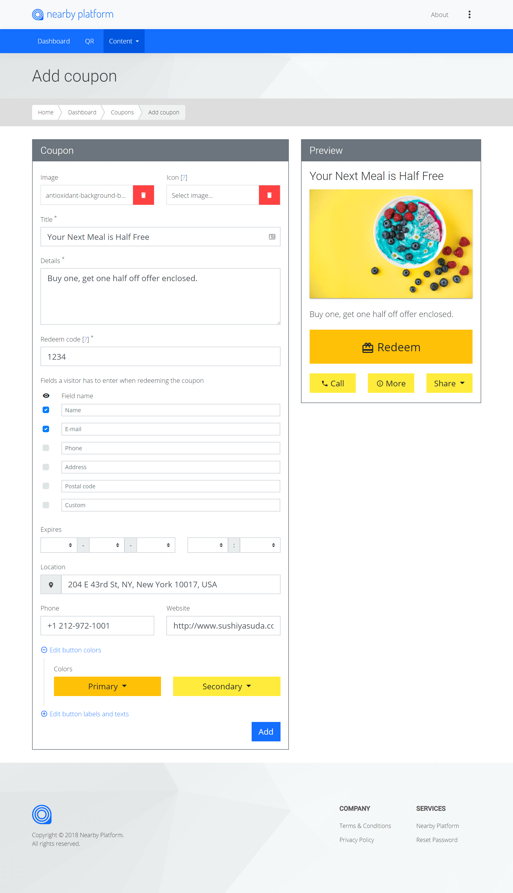

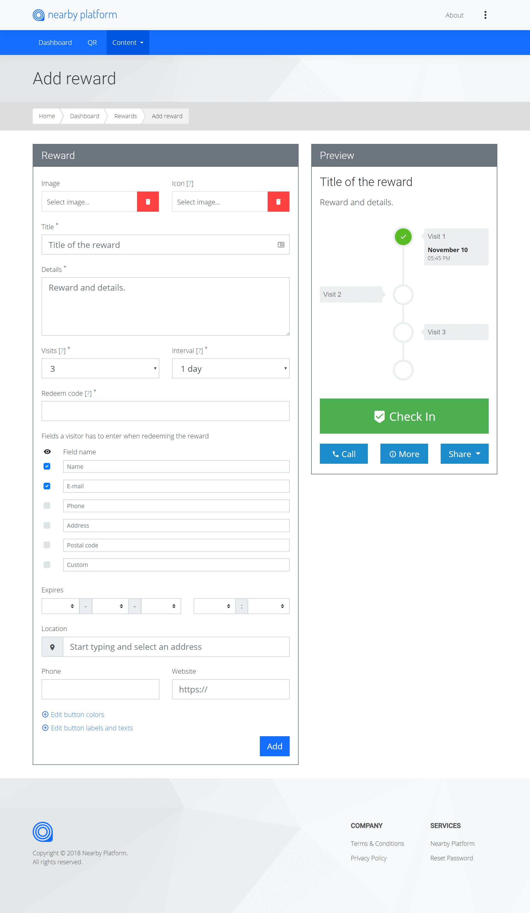

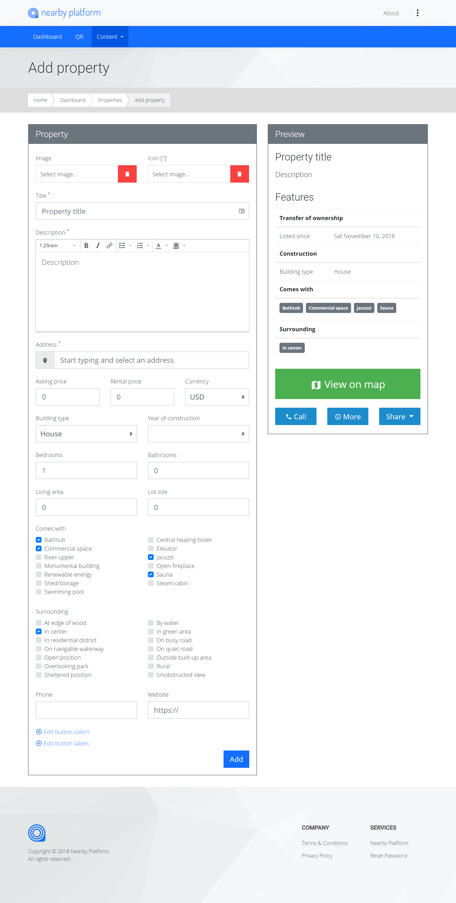


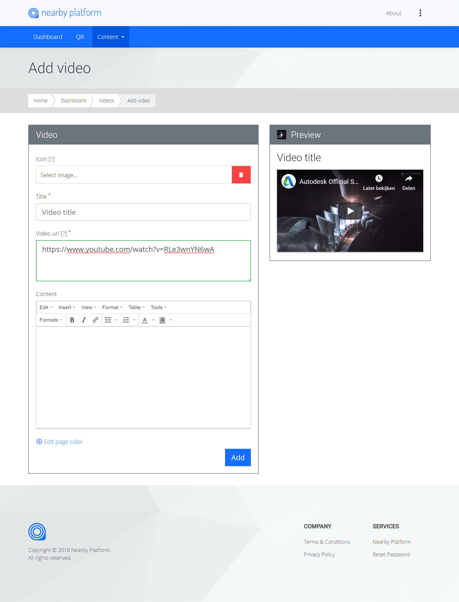

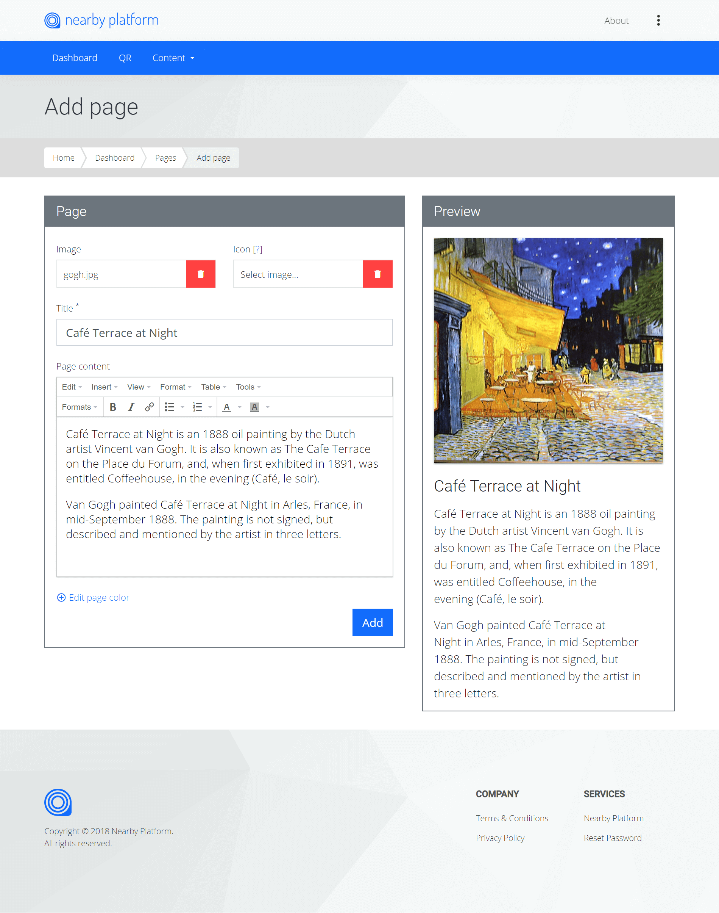

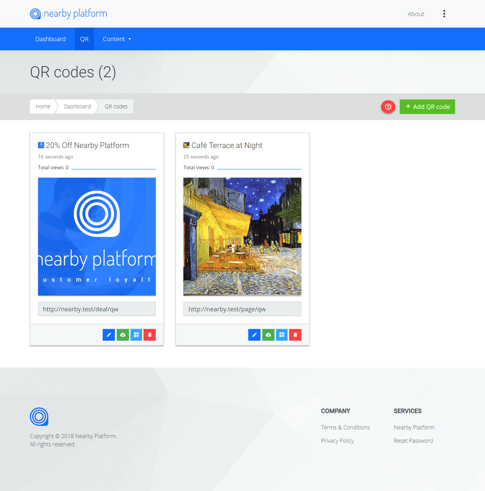

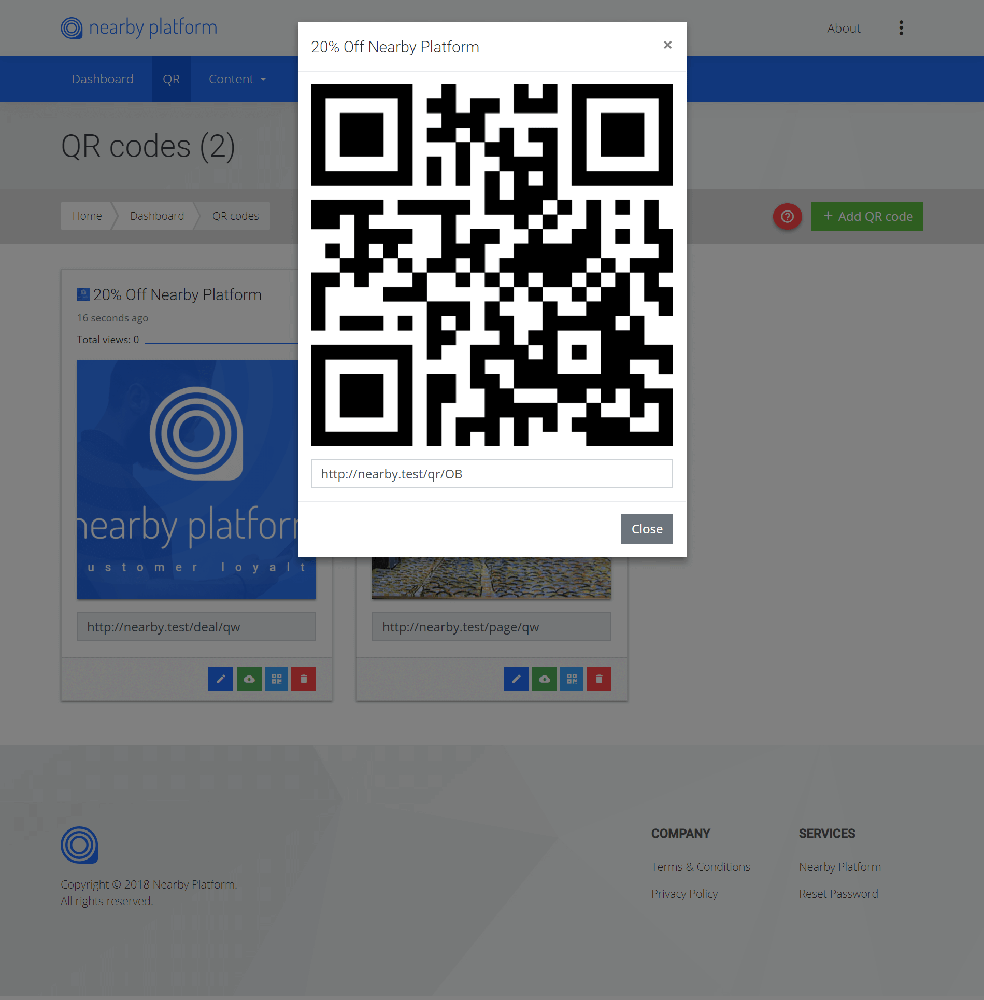

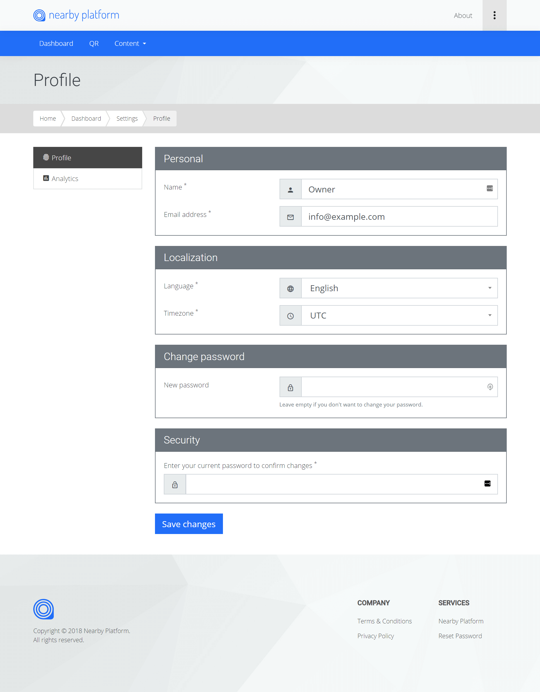

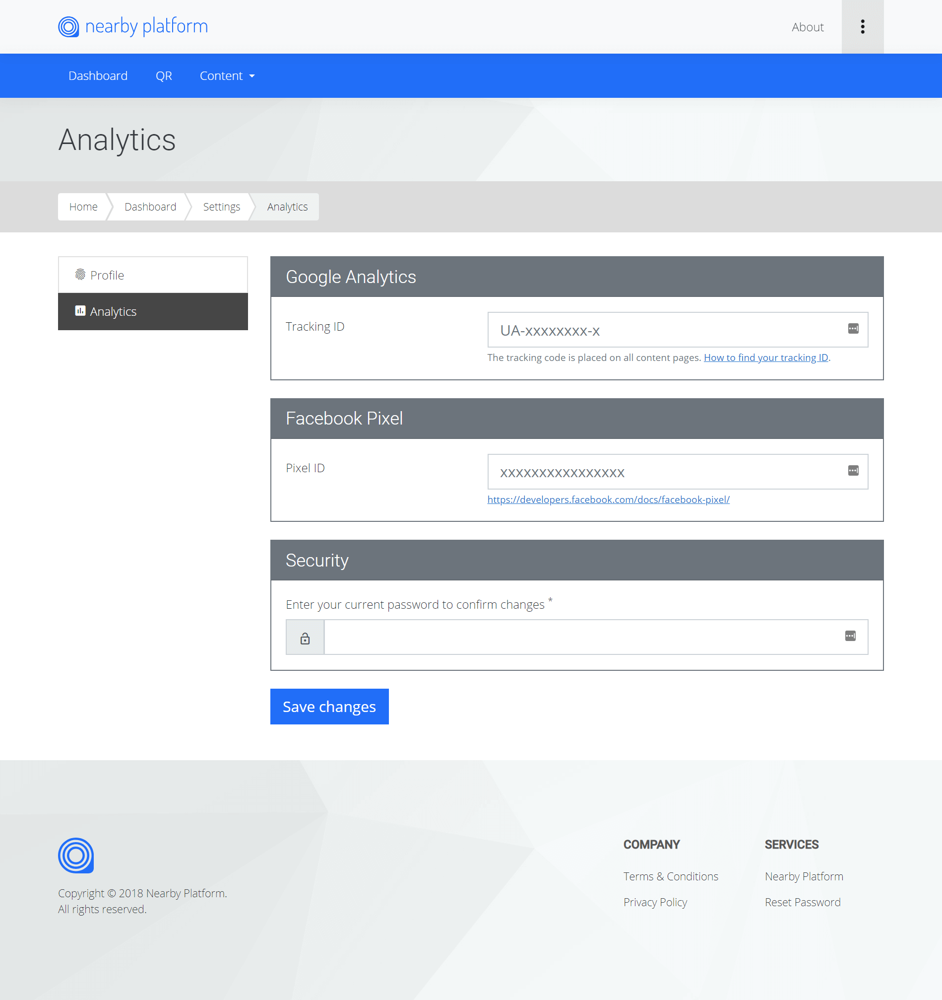

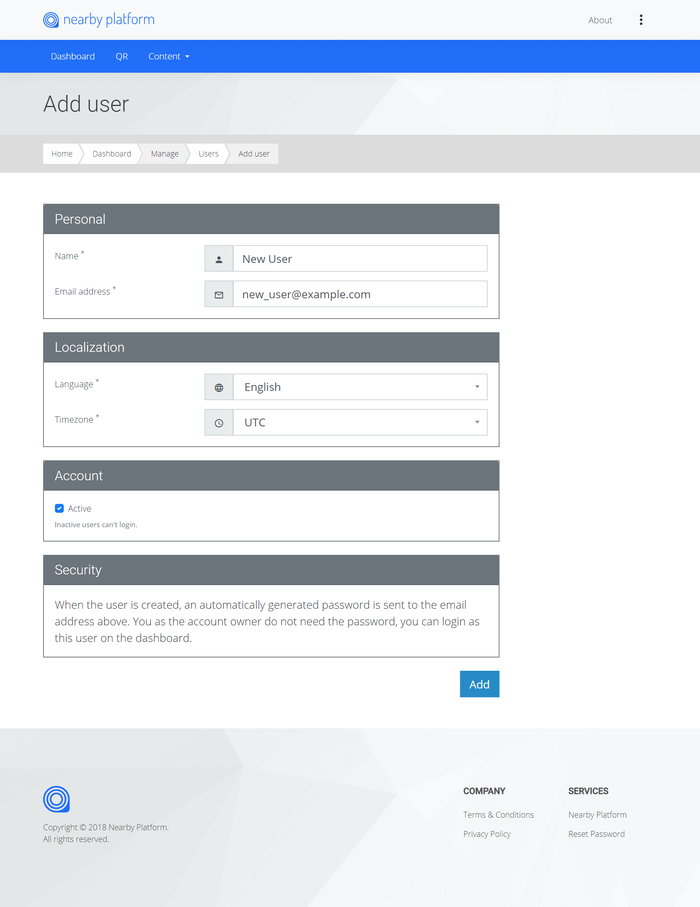

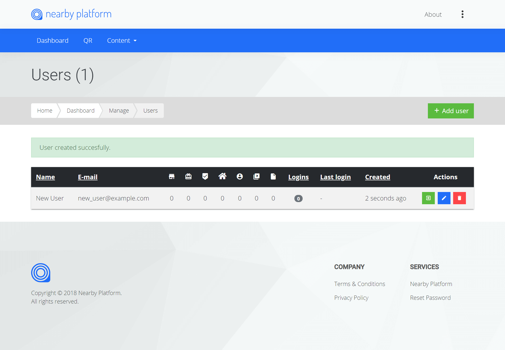